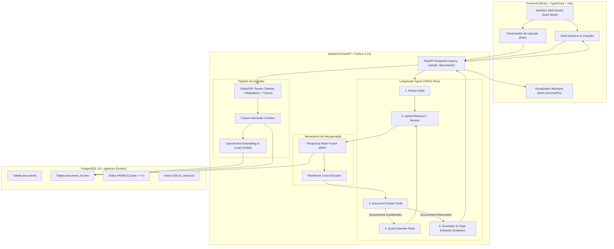
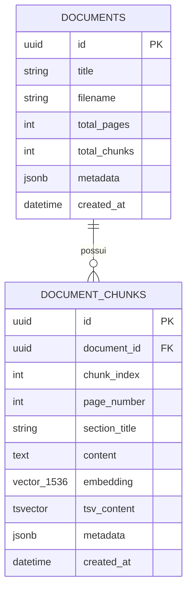

# Arquitetura do Sistema: Enterprise Marketing Knowledge Agent
> **Projeto de RAG Autônomo e Visualização de Dados**  
> Focado em Engenharia de IA, Recuperação Híbrida em 2 Etapas e Visualização Interativa para Entrevista Técnica.

---

## 1. Visão Geral e Propósito

O **Enterprise Marketing Knowledge Agent** é uma solução de Inteligência Artificial para análise e extração de conhecimento sobre relatórios, campanhas e métricas de marketing. O sistema ingere documentos internos complexos (PDFs com relatórios, tabelas de desempenho e narrativas de negócios), indexa esse conhecimento de forma híbrida e oferece uma interface conversacional e analítica com **respostas aterradas (grounded)** e **visualizações dinâmicas de dados** (gráficos interativos).

### Diferenciais Técnicos para a Entrevista:
1. **Recuperação em Duas Etapas (Two-Stage Retrieval)**: Combina busca vetorial densa (`pgvector`) com busca léxica esparsa (`PostgreSQL Full Text Search`) através de **Reciprocal Rank Fusion (RRF)**, seguida de um modelo **Cross-Encoder ultraleve (FlashRank)** para reranking sem custo de API.
2. **Agente com Raciocínio Auto-Reflexivo (Self-Reflective CRAG)**: Implementado no **LangGraph**, o agente avalia se os documentos recuperados são suficientes e relevantes para a pergunta; caso não sejam, reescreve a busca antes de responder, mitigando alucinações.
3. **Extração Estruturada para Data Visualization**: O LLM gera simultaneamente a resposta textual fundamentada e um payload estruturado (via **Pydantic**) pronto para renderização dinâmica de gráficos interativos no React com **Recharts**.
4. **Qualidade e Avaliação (Custom RAG Triad Evals)**: Suite automatizada no `pytest` medindo *Context Relevance*, *Faithfulness* (aterramento) e *Answer Relevance* usando a técnica de *LLM-as-a-Judge*.

---

## 2. Diagrama de Arquitetura do Sistema



---

## 3. Justificativas das Decisões Tecnológicas

| Componente | Tecnologia Escolhida | Alternativas Consideradas | Justificativa Técnica / Trade-off |
| :--- | :--- | :--- | :--- |
| **Banco Vetorial** | **PostgreSQL + pgvector** | Pinecone, Qdrant, Chroma | Reduz complexidade operacional mantendo dados estruturados (relatórios, usuários) e vetoriais no mesmo banco ACID, com suporte nativo a transações e busca híbrida SQL. |
| **Indexação Vetorial** | **HNSW (Hierarchical Navigable Small World)** | IVFFlat | HNSW oferece recall superior e latência de busca estável sob crescimento de dados sem necessidade de reconstruir clusters periodicamente como no IVFFlat. |
| **Busca Híbrida** | **pgvector + PostgreSQL FTS + RRF** | Busca vetorial pura | A busca vetorial falha em termos exatos (códigos de campanha, nomes de produtos, SKUs). O FTS com `tsvector` garante precisão léxica e o RRF funde os rankings sem viés de escala. |
| **Reranking** | **FlashRank (Cross-Encoder local)** | Cohere Rerank API, CrossEncoder PyTorch pesado | FlashRank roda localmente em CPU com footprint ultrabaixo (<100MB), zero custo de API por requisição e latência < 20ms para reordenar o Top-15. |
| **Framework de Agentes**| **LangGraph** | LangChain puro, CrewAI, AutoGen | LangGraph permite grafos direcionados com suporte explícito a ciclos, persistência de estado e controle determinístico de fluxos e transições de erro/auto-reflexão. |
| **Modelos de IA** | **gpt-4o-mini + text-embedding-3-small** | Llama 3 local, Gemini Flash | Maior aderência a `with_structured_output` (Pydantic), custo ínfimo e 1536 dimensões ideais para granularidade semântica em textos comerciais. |
| **Parser de Documentos**| **PyMuPDF (fitz)** | pypdf, Unstructured, PDFMiner | PyMuPDF é escrito em C/C++, sendo até 10x mais rápido que `pypdf`, com extração precisa de coordenadas de blocos, fontes e estruturas tabulares. |
| **Frontend & Charts** | **React + Vite + Recharts** | Streamlit, Chart.js, Grafana | Streamlit é limitado para interfaces modernas de produto. Recharts oferece componentes SVG declarativos, responsivos e fáceis de estilizar no padrão visual Dark Mode. |

---

## 4. Pipeline de Ingestão e Chunking Customizado

### 4.1 Estratégia de Parse e Detecção Estrutural (PyMuPDF)
1. **Identificação de Hierarquia de Títulos**:
   - Mapeamento de tamanho de fonte e peso (`bold`): blocos com fonte significativamente maior que a mediana do documento são marcados como títulos (`H1`, `H2`).
2. **Preservação de Tabelas em Markdown**:
   - Extração estruturada de tabelas preservando linhas e colunas no padrão markdown (`| Coluna A | Coluna B |`). Tabelas não são quebradas no meio de uma linha.
3. **Chunking Semântico com Janela Deslizante Consciente**:
   - Chunks têm como alvo **~600 tokens** com sobreposição de **100 tokens**.
   - As divisões respeitam fronteiras lógicas: nunca cortam sentenças ou linhas de tabelas.
   - Cada chunk herda o título da seção imediatamente superior para preservar o contexto contextual da leitura.

### 4.2 Esquema do Chunk de Documento (Metadados Ricos)
```json
{
  "chunk_id": "uuid",
  "document_id": "uuid",
  "document_name": "relatorio_marketing_q3.pdf",
  "page_number": 4,
  "section_title": "Desempenho de Campanhas Pagas - Google Ads",
  "chunk_index": 12,
  "token_count": 520,
  "content": "...",
  "metadata": {
    "has_table": true,
    "metrics_mentioned": ["CAC", "ROAS", "CTR"]
  }
}
```

---

## 5. Algoritmo de Busca Híbrida e Reranking (Two-Stage Retrieval)

### 5.1 Busca Híbrida via Reciprocal Rank Fusion (RRF)
A consulta do usuário é submetida em paralelo a dois métodos de busca:
1. **Busca Densa (Vetorial)**:
   $$\text{Distância Cosine}: D_{dense} = 1 - \frac{u \cdot v}{\|u\|_2 \|v\|_2}$$
   Recupera os **Top-20** chunks com menor distância utilizando operador `<=>` do pgvector.
2. **Busca Esparsa (Léxica - FTS)**:
   $$\text{Score}: S_{sparse} = \text{ts\_rank\_cd}(to\_tsvector('portuguese', content), \text{websearch\_to\_tsquery}('portuguese', query))$$
   Recupera os **Top-20** chunks ordenados pela relevância léxica.

3. **Fusão RRF**:
   Para cada documento $d$, o score de fusão é calculado com constante $k = 60$:
   $$RRF\_Score(d) = \sum_{m \in \{dense, sparse\}} \frac{1}{k + \text{rank}_m(d)}$$
   Seleciona-se os **Top-15** candidatos mais bem posicionados em ambos os rankings.

### 5.2 Segunda Etapa: Reranker Cross-Encoder (FlashRank)
- Os 15 candidatos e a pergunta original são avaliados conjuntamente por um modelo Cross-Encoder (`ms-marco-TinyBERT-L-2-v2` via FlashRank).
- O Cross-Encoder processa os pares `(query, chunk_text)` simultaneamente com atenção cruzada, pontuando a relevância semântica real.
- Seleciona-se os **Top-4 a 5 chunks** finais para enviar ao LangGraph.

---

## 6. Arquitetura do Agente LangGraph (Self-Reflective CRAG)

### 6.1 Definição do Estado do Agente (`AgentState`)
```python
from typing import Annotated, TypedDict, List, Optional, Dict, Any
from langgraph.graph.message import add_messages

class DocumentChunk(TypedDict):
    content: str
    metadata: Dict[str, Any]
    score: float

class AgentState(TypedDict):
    messages: Annotated[list, add_messages]
    query: str
    retrieved_docs: List[DocumentChunk]
    doc_relevance: str  # "relevant" | "insufficient"
    retry_count: int
    rewritten_query: Optional[str]
    answer: Optional[str]
    citations: List[Dict[str, Any]]
    chart_payload: Optional[Dict[str, Any]]
```

### 6.2 Topologia do Grafo e Transições
1. **`router_node`**:
   - Analisa a entrada do usuário. Se for uma saudação ou comando geral, responde diretamente. Se for pergunta analítica sobre documentos, roteia para `retrieve_node`.
2. **`retrieve_node`**:
   - Executa a busca híbrida (Dense + Sparse) + Rerank FlashRank no banco de dados.
3. **`grader_node` (Avaliador)**:
   - Um LLM avalia se os documentos recuperados contêm fatos suficientes para responder à pergunta com confiança.
   - **Condicional**:
     - Se `doc_relevance == "relevant"`, vai para `generate_node`.
     - Se `doc_relevance == "insufficient"` e `retry_count < 2`, vai para `rewrite_query_node`.
     - Se `retry_count >= 2`, vai para `generate_node` com aviso de dados parciais.
4. **`rewrite_query_node`**:
   - Otimiza a pergunta semântica, decompondo sinônimos e termos de marketing antes de reconsultar o banco.
5. **`generate_node`**:
   - Sintetiza a resposta final com citações diretas aos documentos e extrai o payload do gráfico (quando aplicável).

---

## 7. Contrato de Visualização de Dados (Pydantic Schema para Recharts)

O gerador do LangGraph utiliza **Structured Outputs** para preencher o seguinte esquema Pydantic quando a consulta envolve dados numéricos ou comparativos:

```python
from pydantic import BaseModel, Field
from typing import List, Dict, Any, Optional, Literal

class ChartDataset(BaseModel):
    title: str = Field(description="Título do gráfico explicativo")
    chart_type: Literal["bar", "line", "area", "pie"] = Field(description="Tipo de visualização ideal para os dados")
    x_axis_key: str = Field(description="Chave do eixo X, ex: 'mes', 'campanha', 'canal'")
    data_keys: List[str] = Field(description="Lista de métricas numéricas a plotar, ex: ['roas', 'cac', 'investimento']")
    series_labels: Optional[Dict[str, str]] = Field(description="Rótulos amigáveis para a legenda, ex: {'roas': 'ROAS Médio'}")
    data: List[Dict[str, Any]] = Field(description="Array de registros para os eixos do Recharts")

class AgentResponse(BaseModel):
    answer_markdown: str = Field(description="Resposta aprofundada, com insights e formatação markdown")
    citations: List[Dict[str, Any]] = Field(description="Trechos, páginas e documentos utilizados")
    chart: Optional[ChartDataset] = Field(default=None, description="Dados estruturados para renderização de gráfico no frontend")
```

---

## 8. Esquema de Banco de Dados (SQLAlchemy + pgvector)



- **Extensão**: `CREATE EXTENSION IF NOT EXISTS vector;`
- **Índice Vetorial**:
  ```sql
  CREATE INDEX idx_chunks_embedding ON document_chunks 
  USING hnsw (embedding vector_cosine_ops) 
  WITH (m = 16, ef_construction = 64);
  ```
- **Índice Full-Text Search**:
  ```sql
  CREATE INDEX idx_chunks_tsv ON document_chunks 
  USING gin (tsv_content);
  ```

---

## 9. Suite de Qualidade e Avaliações (RAG Triad Evals)

Para validar o agente antes da entrevista e demonstrar rigor de engenharia:
1. **Golden Dataset**: Arquivo `tests/evals/golden_dataset.json` contendo pares de perguntas de marketing com respostas esperadas e trechos de referência.
2. **Tríade de Avaliação**:
   - **Context Relevance**: Proporção de chunks recuperados que são realmente necessários para a resposta.
   - **Faithfulness (Groundedness)**: Verificação se todas as afirmações numéricas e textuais da resposta derivam exclusivamente do contexto fornecido (zero alucinação).
   - **Answer Relevance**: Adequação da resposta à intenção original da pergunta.
3. **Execução**:
   - `poetry run pytest tests/evals/test_rag_evals.py` exibe uma tabela de pontuações de 0.0 a 1.0 para cada métrica.

---

## 10. Estrutura de Diretórios do Projeto

```text
MARKETING_AGENT/
├── ARCHITECTURE.md                  # Especificação e arquitetura detalhada
├── docker-compose.yml               # Container PostgreSQL 16 + pgvector
├── pyproject.toml                   # Dependências do backend via Poetry
├── poetry.lock
│
├── backend/
│   ├── app/
│   │   ├── __init__.py
│   │   ├── main.py                  # Entrypoint FastAPI
│   │   ├── config.py                # Pydantic Settings (.env)
│   │   ├── database.py              # Sessão assíncrona SQLAlchemy & Engine
│   │   ├── models/                  # Tabelas ORM (Document, DocumentChunk)
│   │   ├── schemas/                 # Schemas Pydantic (Query, Response, Chart)
│   │   │
│   │   ├── ingestion/               # Módulo de Ingestão de Documentos
│   │   │   ├── parser.py            # PyMuPDF extração com tabelas e títulos
│   │   │   └── chunker.py           # Custom semantic chunker
│   │   │
│   │   ├── retrieval/               # Motor de Busca em 2 Etapas
│   │   │   ├── hybrid_search.py     # pgvector + FTS com RRF
│   │   │   └── reranker.py          # FlashRank local cross-encoder
│   │   │
│   │   ├── agent/                   # LangGraph Self-Reflective CRAG
│   │   │   ├── state.py             # Definição do AgentState
│   │   │   ├── graph.py             # Montagem do StateGraph e nós
│   │   │   ├── nodes.py             # Implementação lógica dos nós
│   │   │   └── prompts.py           # Prompts estruturados do sistema
│   │   │
│   │   └── api/                     # Rotas REST
│   │       ├── router.py
│   │       ├── documents.py         # Upload e listagem de PDFs
│   │       └── chat.py              # Query e resposta com gráficos
│   │
│   └── tests/
│       ├── unit/                    # Testes de chunking, parsing e RRF
│       └── evals/                   # RAG Triad Evals com Golden Dataset
│
└── frontend/                        # Interface React + TypeScript + Vite
    ├── package.json
    ├── vite.config.ts
    ├── src/
    │   ├── App.tsx                  # Layout split-screen principal
    │   ├── components/
    │   │   ├── Chat/                # Mensagens, citações e input
    │   │   ├── Visualizer/          # Renderizador Recharts (Bar, Line, etc.)
    │   │   └── Documents/           # Upload de arquivos e lista de documentos
    │   ├── services/api.ts          # Chamadas Axios/Fetch ao backend
    │   └── styles/                  # CSS Vanilla (Dark Mode & Glassmorphism)
```
